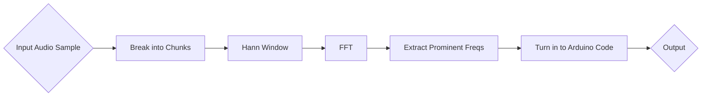

**

# Arduino Audio Challange

**Goal :**
 - Run audio files purely on the arduino's **32kb** of memory
 - Build an audio converter which compresses sound files and turns them in to a format that can be read by the UNO
 - Decompressor on the UNO to read the files
 - Audio must be of acceptable quality and atleast 10 seconds in length

## Proccessing

## Basic Circuit

(Please note that this circuit might be inaccurate so design your own based on your own speaker system)

## Example:
[Inputed Audio](https://raw.githubusercontent.com/ibrahim786alam/Arduino-Audio-32kb-/refs/heads/main/Aria%20math%20FINAL.wav)

30 seconds|
2000 Mhz Sample Rate|
4 bit depth|

[Output Audio](https://raw.githubusercontent.com/ibrahim786alam/Arduino-Audio-32kb-/refs/heads/main/WhatsApp%20Ptt%202026-09-05%20at%201.18.43%20PM.ogg)
Note: there was some more quality loss in recording. audio was clearer 

Audio could me made much clearer my increasing sample rate and bit depth but less audio will be store

